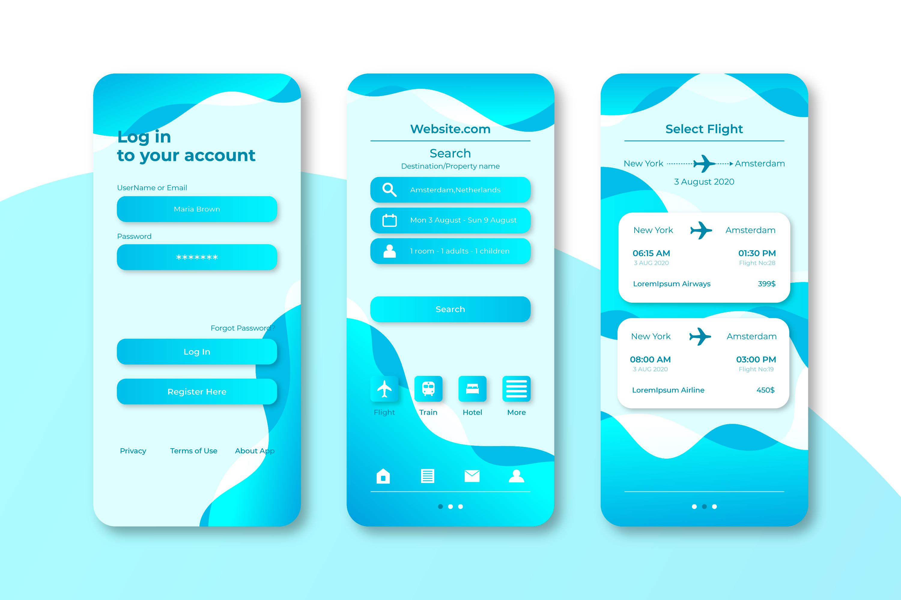

# ✈️ Travel Booking App

**Travel Booking App** is a modern and elegant landing page for a travel booking application, designed using HTML and Tailwind CSS. It allows users to explore features, download the app, read reviews, and get in touch — all in one smooth experience.

---

## 🌐 Live Preview

👉 [Click here to visit the live website](https://abdulfatah1996.github.io/travel-landing/)

---

## 🚀 Features

- Responsive, mobile-first design
- Scroll animations using AOS
- Fixed sticky navigation bar
- Download section (App Store & Google Play)
- User testimonials and FAQ
- Contact form section

---

## Tech Stack

- HTML5
- Tailwind CSS
- AOS (Animate On Scroll)
- GitHub Pages (for deployment)

---

## 📁 Project Structure
├── index.html
├── images/
│ └── Travelbookingapp.jpg
└── README.md

---

## 📩 Contact

If you'd like to collaborate or have questions, feel free to reach out via the contact form on the page.

---

> © 2025 Travel Booking App by [Abdulfatah Obaid](https://github.com/abdulfatah1996). All rights reserved.

